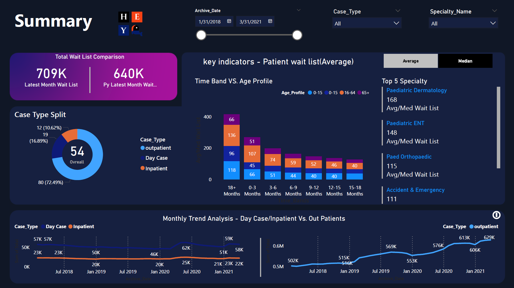

# Healthcare Operations Waitlist Dashboard


**Healthcare Operations Waitlist Dashboard** is an operations intelligence project built to make waitlist pressure, service bottlenecks, and performance patterns easier to understand.

It turns healthcare operations data into a clearer decision-support surface for teams that need to monitor backlog, compare pressure across specialties, and spot where operational attention is needed most.

---

<p align="center">
  
</p>

## Why this project exists

Waitlists are not just long lists of patients or cases.
They are operational signals.

If the only thing you can see is total queue size, you miss the more useful questions:
- where pressure is building fastest
- which specialties are slowing down
- where long-wait cases are becoming more serious
- how backlog changes over time
- which parts of the system need attention first

This project was built to make those signals easier to read.

## What the dashboard helps you understand

- **Waitlist pressure** — where backlog is building most aggressively
- **Service bottlenecks** — which operational lanes are slowing down
- **Trend movement** — whether conditions are stabilizing or worsening over time
- **Specialty comparison** — how pressure differs across healthcare areas
- **Operational priorities** — which areas look most urgent

## Core product view

The dashboard is designed as a decision-support surface, not just a reporting page.

That means the goal is not only to show metrics. It is to help answer:
- what is happening
- where the pressure is building
- what deserves attention first

## Key project strengths

- operational framing instead of generic chart reporting
- clearer visibility into waitlist pressure and service behavior
- star-schema thinking for cleaner analytical structure
- ETL preparation designed for dashboard usability
- portfolio-ready healthcare analytics presentation

## Data architecture

This project uses a **star schema** approach to keep reporting logic organized and scalable.

```text
Source data → cleaning and transformation → analytical model → dashboard layer → operational insight
```

### Modeling focus
- fact table for waitlist and performance measures
- dimensions for specialty, case type, and date
- simplified structure for easier filtering and comparison

## ETL and preparation

Data was cleaned and transformed to support more consistent reporting and easier filtering inside the dashboard.

Preparation focused on:
- category standardization
- cleaner reporting fields
- time-based trend analysis
- dashboard-friendly analytical structure

## What this project demonstrates

This repo is meant to show:
- healthcare operations thinking
- dashboard design for decision support
- analytical communication
- ETL and modeling awareness
- practical BI storytelling

## Why it matters

A lot of dashboards stop at “here are the numbers.”

This project pushes further by framing the data around operational meaning:
- where delays are emerging
- what parts of the system look overloaded
- where service efficiency may be slipping
- what deserves attention now

That shift from reporting to interpretation is the real point of the project.

## Tech stack

- **Power BI** for dashboard design and reporting
- **SQL** for querying and transformation logic
- **Power Query** for shaping and cleaning data
- **Star schema modeling** for analytical structure

## Project status

This is a strong portfolio-ready analytics dashboard focused on healthcare operations visibility.

It should be read as an applied analytics project with a serious operational lens, not just a charting exercise.

## Future improvements

- add dashboard screenshots to the README
- include a data model visual
- add a short walkthrough/demo package
- deepen annotated insight states for clearer storytelling
- expand comparison and drill-down depth

## Repo purpose

This repository shows how healthcare operations data can be translated into a clearer, more decision-oriented dashboard experience.

It is not just about charting backlog.
It is about making system pressure easier to see.

---

Built by Hazem Elerefy
